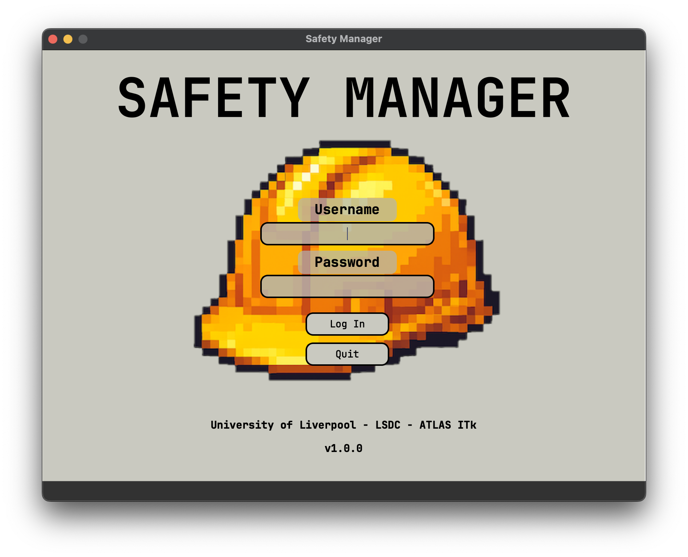
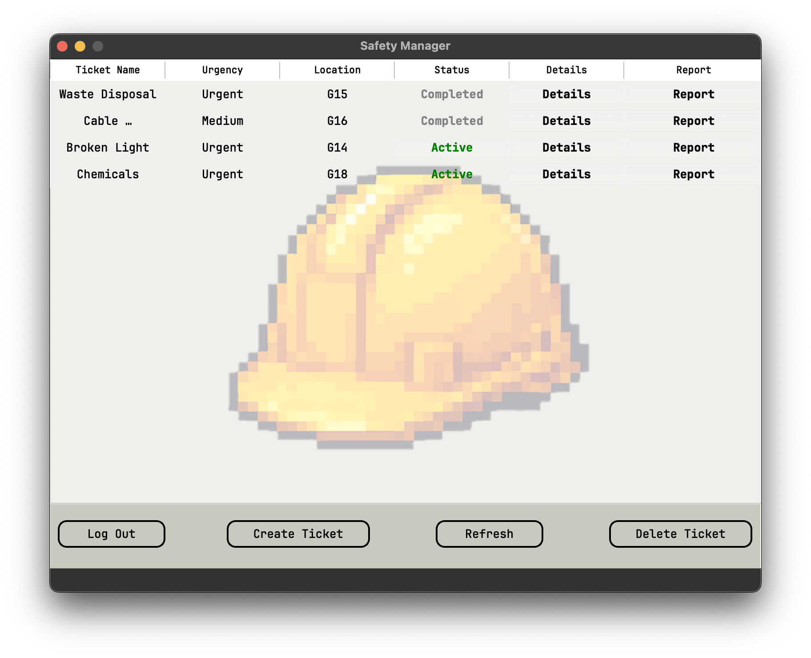

# Safety Manager  
GUI program with active database to submit and control the flow  
of health and safety related queries. Ideal for monitoring issues  
in a controlled settings such as laboratories or workshops.

## Details
  
  
  

## Table of Contents
- [Installation](#installation)
- [Usage](#usage)
- [Images](#images)
- [Features](#features)
- [License](#license) 

## Installation
1. Run in your terminal  
   ```
   $ git clone https://github.com/4ndybuk/SafetyManager
   ```
2. Install dependancies with    
   ```
   $ pip install -r requirements.txt
   ```
4. Create an .env file in your project directory for initialising the database  
   ```
   $ touch ./.env   (bash)
   $ type nul > .env    (Windows)
   ```
4. Option A: Database already made  
     - Speak to relevant person to retrieve Supabase URL and KEY
      ```
      https://supabase.com
      ```
5. Option B: No known database  
     - Create a new supabase project and retrieve the associated URL and KEY
       
6. Append and save the URL and KEY into the .env file in the form of    
   ```
   SUPABASE_URL=your_url_here
   SUPABASE_KEY=your_key_here
   ```
7. Run the program with a supabase authorised user  
   ```
   $ python SafetyManager.py
   ```

## Usage
1. The program requires an existing database project and created authorised user with Supabase
2. Create, delete and update H&S tickets that can be managed across accessible users
3. Single click buttons in the row provide the following actions:  
    - Toggle ticket status between "Active" and "Completed"
    - Update and store ticket information with "Details"
    - "Report" the ticket with the Details content via pre-filled email to the desired recipient

## Images
  

## License
1. This project is licensed under the Non-Commerical License - see the [LICENSE](LICENSE) file for details.
